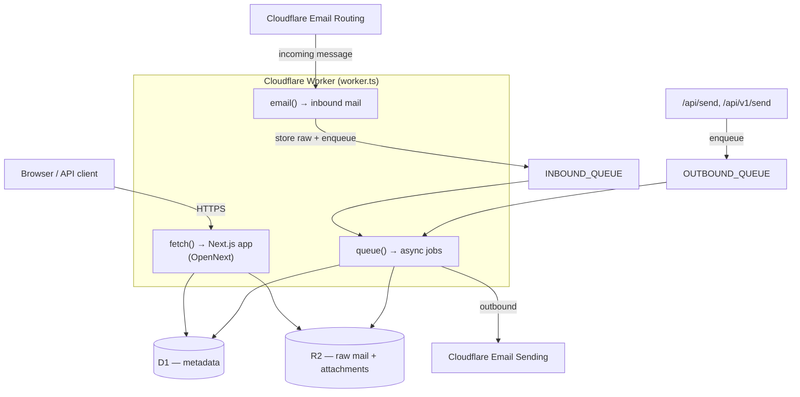
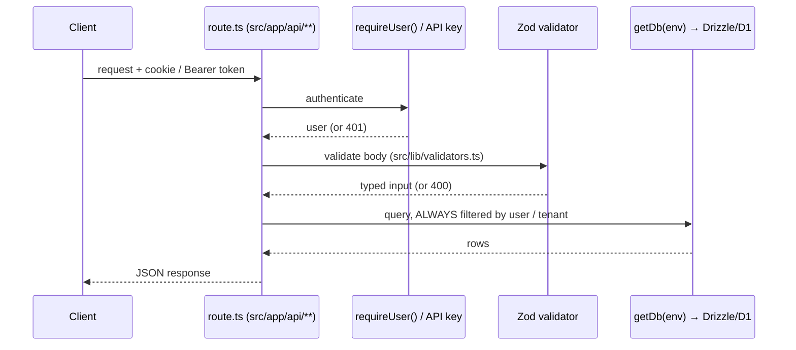

# Architecture

A map of how Lumimail fits together, written so a new contributor (human or agent) can locate any behavior in minutes. For conventions and the work lifecycle, see [`AGENTS.md`](../AGENTS.md) and [`ENGINEERING.md`](./ENGINEERING.md).

## One Worker, three entry points

Everything deploys as a **single Cloudflare Worker** ([`worker.ts`](../worker.ts)). It exposes three handlers:

| Handler | Trigger | Code |
|---------|---------|------|
| `fetch` | HTTP request | Next.js App Router via OpenNext (`.open-next/worker.js`) |
| `email` | Inbound message from Cloudflare Email Routing | stores raw to R2, enqueues to `INBOUND_QUEUE` |
| `queue` | Queue message | `processInboundMessage` or `processOutboundQueue` (discriminated by `isInboundQueueMessage`) |

## Request lifecycle (HTTP API)

Every API route follows this shape. The **cross-tenant filter is mandatory** on every query touching mailbox / message / domain / routing data — it's the strongest invariant in the codebase (see [`SECURITY.md`](../SECURITY.md)).

## Inbound mail flow

1. Cloudflare Email Routing delivers to `worker.ts` → `email()`.
2. Raw message stored to R2 (`storeRawToR2`); a lightweight payload is enqueued to `INBOUND_QUEUE`.
3. `queue()` → `processInboundMessage` (`src/lib/email/inbound.ts`) parses, applies routing/aliases/filters, persists metadata to D1, and links the R2 blob.

## Outbound mail flow

1. `/api/send` (session) or `/api/v1/send` (API key) validates and enqueues to `OUTBOUND_QUEUE`.
2. `queue()` → `processOutboundQueue` (`src/lib/email/send.ts`) delivers via Cloudflare Email Sending.

## Where things live

| Layer | Path | Notes |
|-------|------|-------|
| HTTP routes | `src/app/api/**/route.ts` | One file per endpoint; `[id]` for params |
| Dashboard UI (mailbox-scoped) | `src/app/(dashboard)/` | + `src/components/` |
| Admin UI (account-scoped) | `src/app/(admin)/` | org/domain/member management |
| Auth | `src/lib/auth/` | `cookies.ts` (`requireUser`), `session.ts`, `password.ts`, `org-guard.ts`, `client.ts` (`authFetch`) |
| Email engine | `src/lib/email/` | `inbound.ts`, `send.ts`, `routing.ts`, `parse.ts`, `alias-targets.ts`, `webhooks.ts` |
| Cloudflare API | `src/lib/cloudflare-api.ts` | domain provisioning (DNS, routing, sending) |
| DB schema | `src/db/schema/index.ts` | Drizzle tables |
| Validators | `src/lib/validators.ts` | Zod; all request bodies |
| IDs | `src/lib/ids.ts` | `newId(prefix)` → `prefix_nanoid` |
| Rate limiting | `src/lib/rate-limit.ts` | |
| i18n | `src/i18n/messages/` | 11 locales, RTL for Arabic |
| Migrations | `drizzle/migrations/` | `npm run db:migrate:local` / `:remote` |

## Storage model

- **D1 (SQLite):** all metadata — users, orgs, mailboxes, messages, domains, routing rules, API keys, contacts, labels, filters.
- **R2:** raw RFC822 messages and attachments. D1 rows reference R2 keys.
- **Queues:** `INBOUND_QUEUE` and `OUTBOUND_QUEUE` decouple mail processing from the request/email handlers; failures `retry({ delaySeconds: 10 })`.

## The companion: IMAP/SMTP bridge

[`imap-bridge/`](../imap-bridge/README.md) is a standalone Node service that speaks IMAP4rev1 + SMTP to desktop/mobile clients and proxies to the Lumimail API using an API key as the password. It is deployed separately from the Worker. Spec: [`docs/specs/F13-imap-smtp-bridge.md`](./specs/F13-imap-smtp-bridge.md).

## Testing topology

- `tests/unit/` mirrors `src/` paths — unit + integration (Vitest), 100% coverage gate on included files.
- `tests/e2e/` — Playwright, for user-visible flows.
- `npm run verify` = typecheck + lint + `test:cov`. This is the definition of done.
